# OPTIVAULT — Warehouse Management & Slot Allocation System

> **Frontend Project** · HTML5 · CSS3 · Vanilla JavaScript · Bootstrap 5 · LocalStorage

**Live Demo:** [https://optivault-production.up.railway.app](https://optivault-production.up.railway.app)

---

## 1. Problem Statement

Companies running multiple warehouses need to place incoming stock efficiently, track occupancy across sites in real time, and make sure different types of users — company admins, warehouse supervisors, and the platform team that runs the whole system — only see and touch what's relevant to their role.

OptiVault is a full frontend simulation of such a system. It covers four connected areas:

- **Authentication & onboarding** — role-based sign in and company registration
- **Warehouse floor** — a live slot map with an automatic allocation engine, run by supervisors
- **Company ledger** — a read-only, company-wide oversight view for company admins
- **Platform console** — an internal tool for the OptiVault team to approve companies and warehouses

---

## 2. Proposed Solution

OptiVault is built entirely with **HTML, CSS and Vanilla JavaScript**, using the browser's LocalStorage as its data layer instead of a backend or database. It demonstrates:

- Role-based authentication and company registration with an approval workflow
- Client-side form validation across every form in the app
- A first-fit-style slot-allocation algorithm driven by item dimensions, weight, fragility, and pick velocity
- A live optimizer that flags rack pressure, overfill, waiting stock, and travel-time inefficiency
- A company-wide ledger that reads the same live data suppliers write to — no separate copy
- An internal approval console that can actually build a warehouse's rack plan and issue a passcode
- Cross-tab live sync, using the browser's `storage` event, so a change made on one page shows up on another without a manual refresh

The project is a **frontend demonstration** — there is no backend, API, or real database anywhere in the system.

---

## 3. Features

### Authentication & Onboarding
- ✅ Role-based Sign In (Company Admin / Supervisor / Platform Admin)
- ✅ Organization email and password validation
- ✅ Invalid credential and pending-approval handling
- ✅ Company registration form with duplicate-email detection
- ✅ Minimum password length and confirm-password checks
- ✅ New companies stored with `pending` status
- ✅ Registration reference generation and animated success screen
- ✅ Client-side session creation and role-based redirection

### Warehouse Floor (Supervisor)
- ✅ Passcode-gated access, one passcode per warehouse
- ✅ Live rack/slot occupancy view with search and filters (all / near-full / has-space)
- ✅ Stock in — automatic slot allocation, no manual slot picking
- ✅ Stock out — removal with automatic reallocation of anything queued
- ✅ Optimizer with four live checks: rack pressure, overfill, waiting units, travel time
- ✅ Zone-level utilization reports and a running activity log
- ✅ 3D view placeholder (not yet built)

### Company Ledger (Company Admin)
- ✅ Read-only, live view of every warehouse the company runs
- ✅ Utilization stats: active sites, pending requests, average utilization, total slots, units waiting
- ✅ Site filtering (all / over 65% full / under 40% full)
- ✅ Warehouse addition requests and removal requests, sent to the platform team
- ✅ Live updates via the browser's `storage` event when a supervisor changes stock in another tab

### Platform Console (Platform Admin)
- ✅ Queue of company sign-ups, with approve/decline actions
- ✅ Queue of warehouse open/removal requests, with approve/decline actions
- ✅ Approving a warehouse request builds a real rack plan, issues a passcode, and adds the site to the live directory
- ✅ Read-only table of every site on the platform, across every client company

### UI / UX
- ✅ Responsive layouts on every page
- ✅ Animated slot-utilization percentages and progress bars
- ✅ Role selection banner on Sign In
- ✅ Form-level and field-level error states
- ✅ Loading / verification states on buttons
- ✅ Reduced-motion support
- ✅ Mobile-friendly layouts throughout

---

## 4. Technology Stack

| Layer | Technology |
|---|---|
| Structure | HTML5 |
| Styling | CSS3 |
| Logic | Vanilla JavaScript (ES6+) |
| UI Framework | Bootstrap 5.3.3 (auth pages only) |
| Fonts | Google Fonts — Space Grotesk & Inter |
| Client-side Storage | Browser LocalStorage |
| Data Format | JavaScript Objects / JSON |
| Browser APIs | DOM API, URLSearchParams, `storage` event, `requestAnimationFrame`, `performance.now()` |
| Version Control | Git / GitHub |
| Hosting | Railway |

---

## 5. Architecture

```text
                         USER
                           |
                           v
                    LANDING PAGE
                           |
                           v
                    ROLE SELECTION
                           |
                           v
                    +--------------+
                    | Sign In Page |
                    +--------------+
                           |
                    Selected Role
                           |
             +-------------+-------------+
             |             |             |
             v             v             v
        Company Admin  Supervisor   Platform Admin
             |             |             |
             v             v             v
      Company Ledger  Warehouse    Platform Console
      (read-only)     Select →         (approvals)
                       Floor
```

Each destination page reads from the same shared warehouse data defined in `js/floor.js` — nothing is duplicated per role.

---

## 6. Authentication Flow

```text
User selects role
       |
       v
Role stored / retrieved
       |
       v
User opens Sign In
       |
       v
Enter email + password
       |
       v
Validate form
       |
       +----------------+
       |                |
    Invalid            Valid
       |                |
       v                v
 Show error       Verify credentials
                        |
                 +------+------+
                 |             |
               Invalid        Valid
                 |             |
                 v             v
            Show error    Start session
                               |
                               v
                       Redirect by role
```

The selected role can be obtained from the URL query string or from LocalStorage, with `company-admin` used as the fallback role.

---

## 7. Role-Based Access

| Role | Entry point | Destination | Purpose |
|---|---|---|---|
| `company-admin` | `signin.html?role=company-admin` | `company-dashboard.html` | Company-level warehouse oversight, view only |
| `supervisor` | `signin.html?role=supervisor` | `warehouse-select.html` → `warehouse-floor.html` | Passcode-gated warehouse access, stock control |
| `platform-admin` | `signin.html?role=platform-admin` | `platform-admin.html` | Approving companies and warehouse requests |

The role is also displayed on the Sign In card so the user can see which access type was selected.

---

## 8. LocalStorage Architecture

The entire application's data lives in LocalStorage — there is no server anywhere in the system.

| Key | Purpose |
|---|---|
| `optivault-companies` | Registered company accounts |
| `optivault-role` | Role selected on the landing page / Sign In |
| `optivault-session` | Currently authenticated user |
| `optivault-warehouse-<ID>` | Slot map for one specific warehouse |
| `optivault-active-warehouse` | Which warehouse a supervisor currently has open |
| `optivault-unlocked` | Passcode-gate flag for the current warehouse |
| `optivault-warehouse-requests` | Queue of open/delete warehouse requests |
| `optivault-approved-warehouses` | Warehouses created via an approved request |
| `optivault-removed-warehouses` | Warehouses removed via an approved deletion |

### `optivault-companies`
```js
{
    name: "Company Name",
    contact: "Contact Person",
    email: "company@example.com",
    password: "password",
    requestedWarehouses: 3,
    status: "pending",
    warehouses: []
}
```

### `optivault-role`
```text
company-admin
```

### `optivault-session`
```js
{
    role: "company-admin",
    email: "company@example.com",
    company: "Company Name"
}
```

---

## 9. Demo Data

Seeded automatically on first load if no company data already exists:

```text
Company:  Harbor & Bell Logistics
Email:    ops@harborbell.com
Password: warehouse123
Status:   approved
```

Three warehouses ship pre-built with real rack plans:

| ID | City | Passcode |
|---|---|---|
| `WH-MOH` | Mohali — Phase 8 Yard | `4021` |
| `WH-CHD` | Chandigarh — Industrial Area | `5530` |
| `WH-PAT` | Patiala — Rajpura Road | `6174` |

Platform admin login is a single fixed credential:
```js
const PLATFORM_ADMIN = {
    email: 'admin@optivault.internal',
    password: 'optivault2026'
};
```

---

## 10. Credential Verification

`checkCredentials()` runs the actual check:

### Platform Admin
Compared directly against the fixed `PLATFORM_ADMIN` constant defined in the JavaScript file.

### Company Accounts
1. Retrieves companies from LocalStorage.
2. Searches for the entered email.
3. Checks the password.
4. Checks the company's `status`.
5. Creates a session if everything is valid.

If the company isn't found, an "email not registered" error shows. If the password doesn't match, a password-specific error shows. If the company is still `pending`, sign-in is blocked with an approval-pending message.

---

## 11. Sign In Validation

The Sign In form validates organization email and password. On submit, JavaScript prevents the default browser submission and checks both fields.

If validation fails: the invalid field gets an error style, the first invalid field receives focus, and the form does not submit.

If validation succeeds: the button switches to a "verifying" state while credentials are checked against LocalStorage.

---

## 12. Company Registration Flow

```text
Register Company → Enter Details → Validate Fields → Validate Email
    → Check Password Length → Confirm Password Match
    → Check Duplicate Email → Create Company (status: "pending")
    → Save to LocalStorage → Success Screen
```

| Check | Result |
|---|---|
| Empty field | Registration rejected |
| Invalid email | Registration rejected |
| Password shorter than 6 characters | Registration rejected |
| Passwords do not match | Registration rejected |
| Email already registered | Registration rejected |
| All data valid | Registration accepted, status = `pending` |

---

## 13. Company Approval Workflow

```text
Company Registration → Pending → Platform Admin Review → Approved → Company Can Sign In
```

A `pending` company cannot sign in until a platform admin approves it from the Platform Console (Section 17).

---

## 14. Registration Success Screen

After a successful registration:
- Displays the registered company name
- Generates a registration reference in the format `OV-YEAR-RANDOMNUMBER` (e.g. `OV-2026-4827`)
- Plays an animated grid-clear transition before revealing the confirmation message
- Links back to the main site and to Sign In

---

## 15. Warehouse Floor & Slot Allocation Engine

This is the core of the project, implemented in `js/floor.js` and used by every page that touches warehouse data.

### How a unit gets placed
1. Incoming stock (dimensions, weight, quantity, pick velocity, fragile flag) is expanded into individual units.
2. Each unit is checked against every slot's remaining volume and weight capacity.
3. Fragile items are isolated — they only go into a slot of their own.
4. Remaining valid slots are ranked by matching pick velocity to distance from the dock: fast movers are pushed toward slots near the dock, slow movers toward slots deep in the warehouse.
5. If nothing fits, the unit is placed into a **waiting-for-space** queue instead of failing outright.

### Removing stock
Freeing a slot automatically triggers `runReallocation()`, which retries every unit sitting in the waiting queue against the newly available space.

### The Optimizer
Recalculated from the live slot map on every change — nothing is hardcoded. It runs four checks:

| Check | What it flags |
|---|---|
| Rack pressure | Any rack over 90% full, with the nearest rack that still has room |
| Overfill | Any slot over 92% full, grouped per rack |
| Waiting units | Stock that couldn't be placed, retried automatically once space frees |
| Travel time | Fast movers sitting far from the dock while a nearer slot could accept them |

### Reports
Zone-level utilization (racks grouped and ordered by distance from the dock) plus a running activity log of every placement, removal, and reallocation.

---

## 16. Company Ledger

`company-dashboard.html` / `js/admin.js` give a company admin a **read-only** view across every warehouse their company runs.

- Every figure (utilization, occupied slots, units waiting) is summed live from each warehouse's own slot map — there is no separate copy of the data.
- Company admins can file two kinds of requests to the platform team: **add a warehouse** or **remove a warehouse**. Neither action happens instantly; both stay `pending` until the platform admin decides.
- The `storage` event keeps this page updated automatically the moment a supervisor changes stock on the floor page, even in a different browser tab.

---

## 17. Platform Console

`platform-admin.html` / `js/platform.js` is the internal tool for the OptiVault team.

- **Company queue** — approve or decline new sign-ups. A declined or still-pending company cannot sign in.
- **Warehouse request queue** — approving an *addition* request actually builds a new rack plan, generates a passcode, and adds the site to `WAREHOUSE_DIRECTORY`, so it immediately appears in the company's ledger and the supervisor's warehouse picker. Approving a *removal* request takes the site out of the directory.
- **All Sites table** — a read-only list of every warehouse running on the platform, across every client company.

---

## 18. Warehouse Utilization Animation

Slot cards on the auth pages carry a target percentage:
```html
<div class="scard" data-target="92">
```
JavaScript reads it via `card.dataset.target` and animates the percentage and bar fill using `setTimeout()`, `performance.now()`, `requestAnimationFrame()`, and an easing function — creating a live-feeling warehouse visualization on page load. This respects `prefers-reduced-motion`.

---

## 19. UI Design

Each role has a distinct visual language, all sharing the same underlying conventions:

- **Auth pages** — cream background, off-white cards, terracotta accent, Space Grotesk headings, Inter body text, graph-paper background.
- **Company ledger** — warm paper theme, Georgia serif typography.
- **Platform console** — plainer, darker, internal-tool aesthetic, Arial/system sans-serif.
- **Warehouse floor** — neutral cream workspace theme matching the auth pages' tone.

Shared conventions across all of them: rounded/square cards depending on role, thin borders, minimal shadows, and a dedicated `:focus-visible` state for keyboard navigation.

---

## 20. Responsive Design

### Desktop
```text
+-----------------------------------------------+
| Header                                        |
+-----------------------------------------------+
| Main content area                             |
| (varies by page — two-column on auth pages,   |
| grid layouts on ledger/console pages)         |
+-----------------------------------------------+
```

### Mobile
All multi-column layouts collapse to single-column below ~900px (auth pages break slightly earlier at ~960px). The password-confirmation pair on the registration page also stacks vertically on small screens.

---

## 21. Accessibility & UX

- Semantic form labels and correct HTML input types
- `autocomplete` attributes set deliberately per field (including disabling it where autofill would cause UI conflicts, e.g. the numeric warehouse passcode field)
- Error messages exposed via `role="alert"`
- Focus automatically moves to the first invalid field on a failed validation
- Visible keyboard focus states (`:focus-visible`) throughout
- Reduced-motion support on every animated element
- Disabled/loading button states during verification and submission

---

## 22. Folder Structure

The repository is a **flat structure**: every HTML page sits at the repository root, alongside two shared asset folders — `css/` and `js/`. There is no separate `html/` folder, and every page uses root-relative paths (no `../`).

```text
OptiVault/
│
├── css/
│   ├── styles.css             ← Landing page
│   ├── sigin.css              ← Sign In / Sign Up
│   ├── floor.css              ← Warehouse floor / picker
│   ├── admin.css              ← Company ledger
│   └── platform.css           ← Platform console
│
├── js/
│   ├── script.js               ← Landing page logic
│   ├── sigin.js                 ← Auth & registration
│   ├── floor.js                 ← Core allocation engine, shared by every other page
│   ├── select.js                ← Warehouse picker (supervisor)
│   ├── admin.js                 ← Company ledger
│   └── platform.js              ← Platform console
│
├── index.html
├── signin.html
├── signup.html
├── warehouse-select.html
├── warehouse-floor.html
├── company-dashboard.html
├── platform-admin.html
│
└── README.md
```

**Load order matters** — `floor.js` must load before any page-specific script that depends on it:
```html
<script src="js/floor.js"></script>
<script src="js/admin.js"></script>
```

---

## 23. Cross-Tab Live Sync

The company ledger and platform console listen for the browser's native `storage` event, which fires in *other* tabs whenever LocalStorage changes in *one* tab (it does not fire in the same tab that made the change). This is how a supervisor placing stock on the floor page instantly updates the company admin's utilization numbers in a different tab, without any backend or polling involved.

---

## 24. Security Disclaimer

This is a **frontend-only educational demo**. All credentials, sessions, and company data live in LocalStorage in plain text, and the platform-admin password is hardcoded directly in client-side JavaScript. None of this is production-safe.

A real deployment would require:
- Backend authentication
- Password hashing (bcrypt/Argon2)
- A real database (MongoDB / PostgreSQL)
- Server-side authorization and RBAC
- Secure session/token management (JWT or server sessions)
- HTTPS
- Email verification and password reset flows

---

## 25. Future Scope

| Feature | Future Implementation |
|---|---|
| Secure authentication | Backend authentication API |
| Password security | Hashing using bcrypt/Argon2 |
| Database | MongoDB / PostgreSQL |
| Session security | JWT or secure server sessions |
| Email verification | SMTP / transactional email |
| Forgot password | OTP / reset-link workflow |
| 3D warehouse view | Currently a disabled placeholder |
| Role management | Server-side RBAC |
| Warehouse access | Database-backed permissions |

---

## 26. How to Run

### Live Demo
**[https://optivault-production.up.railway.app](https://optivault-production.up.railway.app)**

### Locally
```bash
git clone https://github.com/Sakshamv511/OptiVault.git
cd OptiVault
```
Open any `.html` file directly in a browser. No build step, server, or `npm install` needed.

---

## 27. Application Flow

```text
Landing Page
     |
     +-------------------+
     |                   |
     v                   v
   Sign In          Register Company
     |                   |
     v                   v
Role Selection      Registration Form → Validation → Pending → Success Screen
     |
     v
Credentials → Verification → Create Session
     |
     +----------------+----------------+
     v                v                v
Company Ledger   Warehouse Picker  Platform Console
(view-only)       → Passcode →         (approvals)
                    Floor
```

---

## 27. Application Flow Screenshots

The screenshots below follow the main user journey through OptiVault, from the landing page and authentication to warehouse operations, company oversight, and platform administration.

### 27.1 Landing & Authentication

| Step | Screen |
|---|---|
| 1 | **Landing Page — Light Theme** |
| 2 | **Landing Page — Dark Theme** |
| 3 | **How It Works** |
| 4 | **Role Selection** |
| 5 | **Company Registration** |
| 6 | **Company Admin Sign In** |
| 7 | **Supervisor Sign In** |

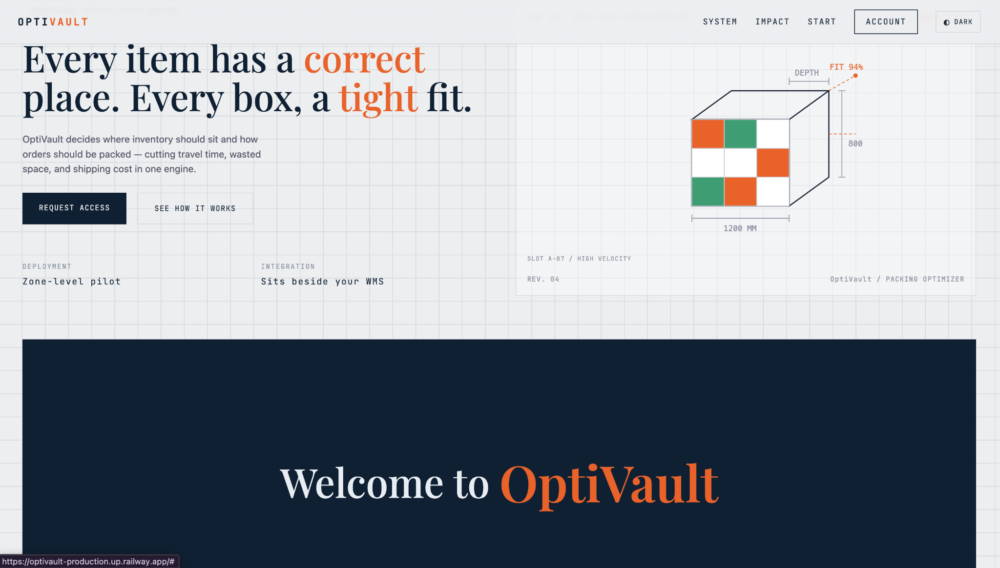

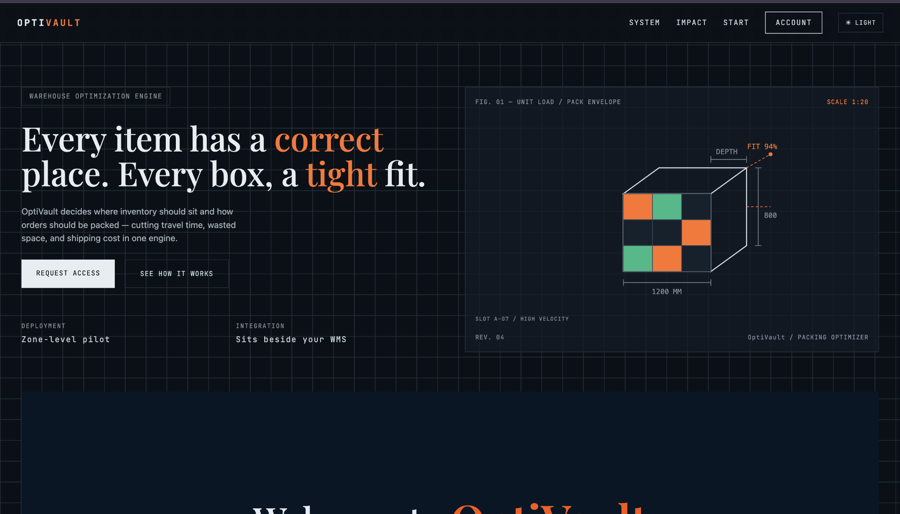

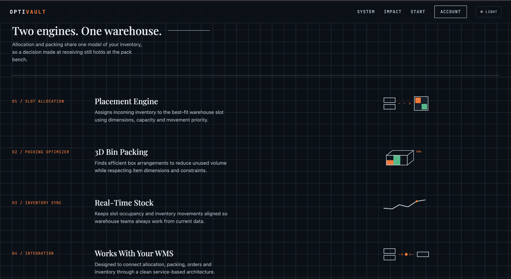

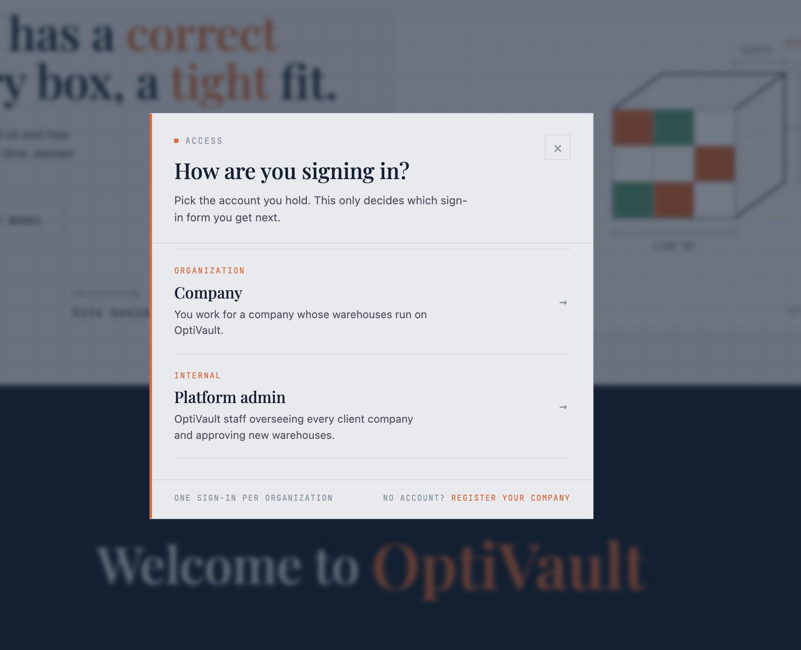

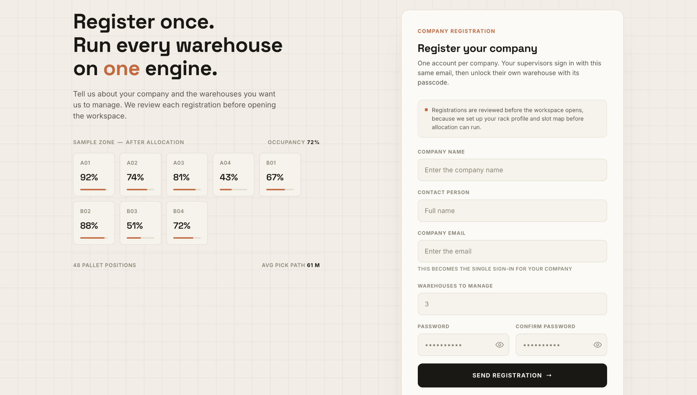

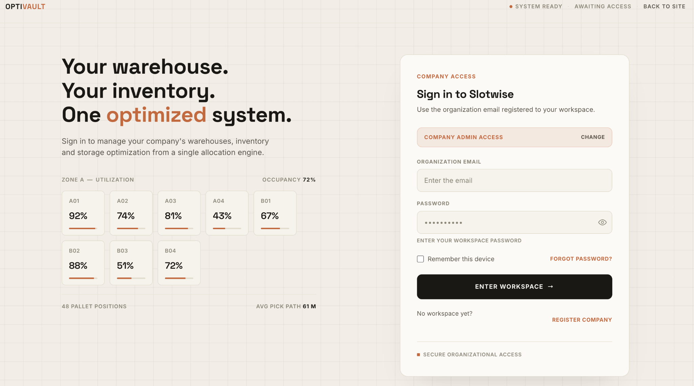

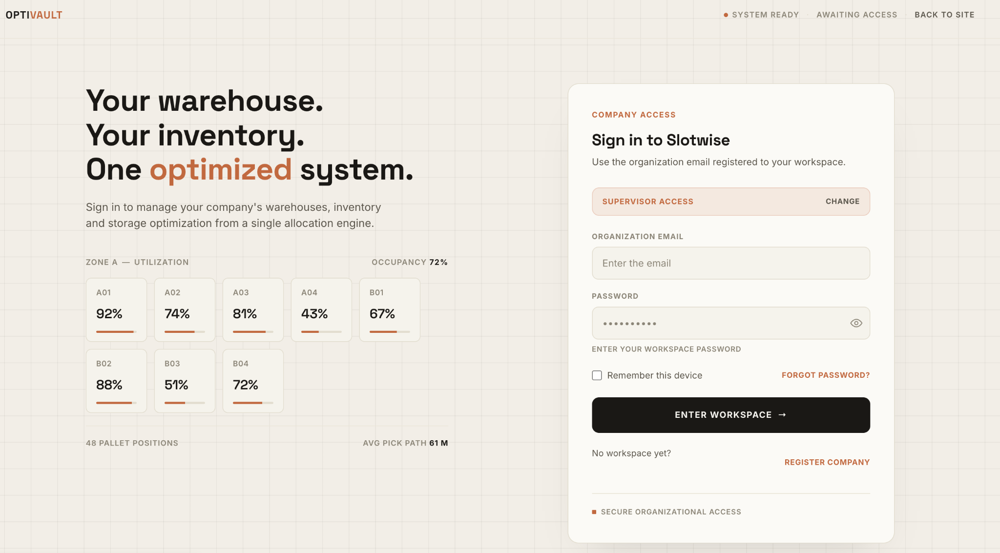

### 27.2 Supervisor / Warehouse Flow

**Supervisor → Select Warehouse → Enter Passcode → Warehouse Floor → Stock In / Out**

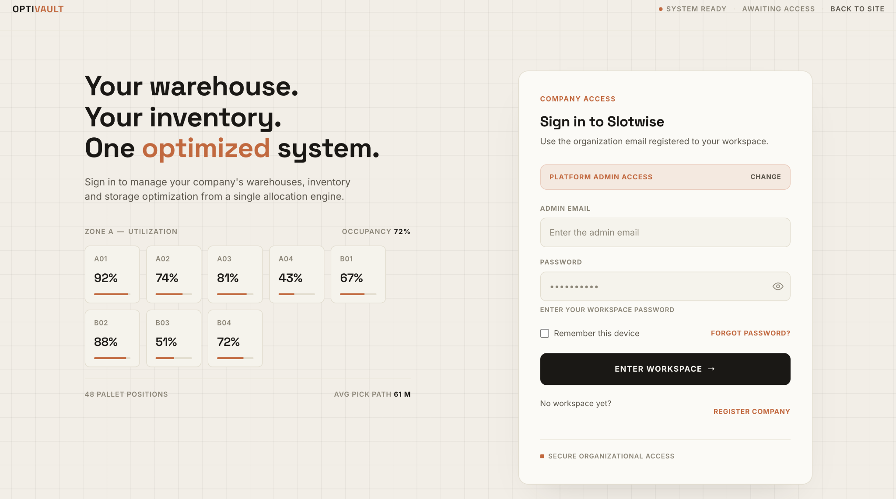

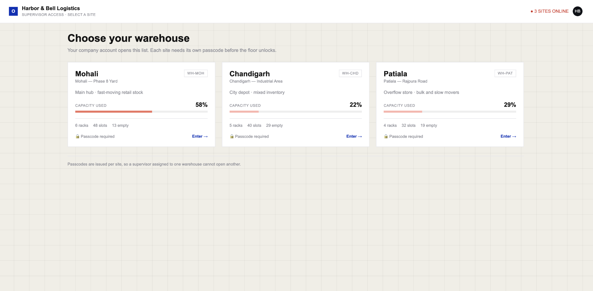

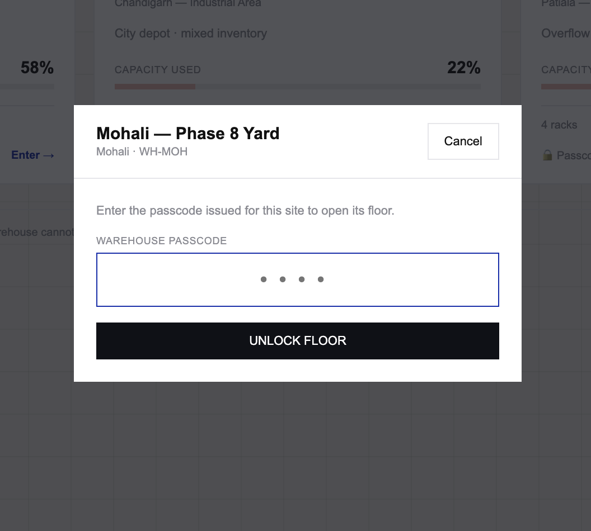

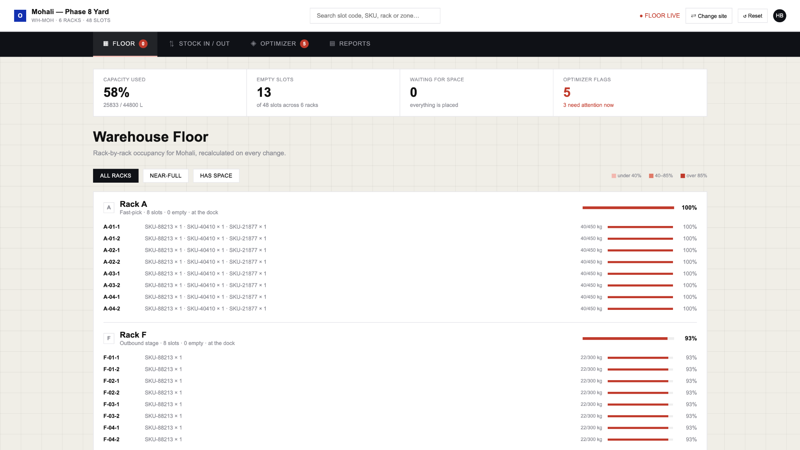

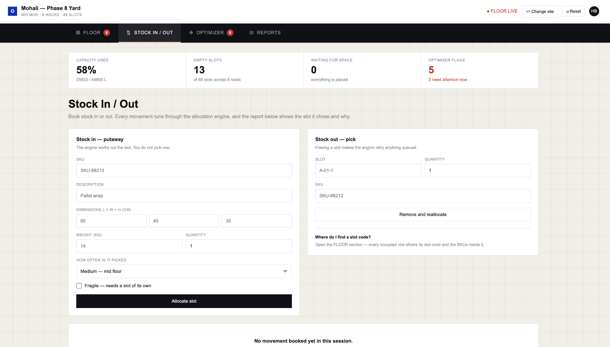

### 27.3 Company Admin Flow

**Company Admin → Warehouse Ledger → Submit Addition / Removal Requests**

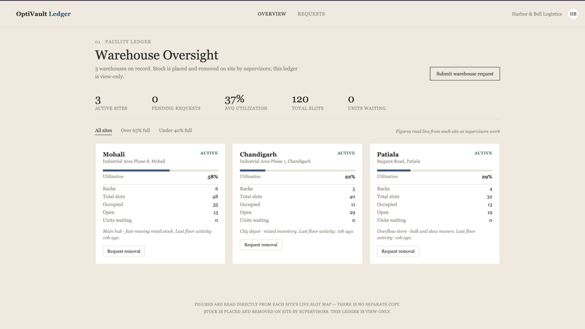

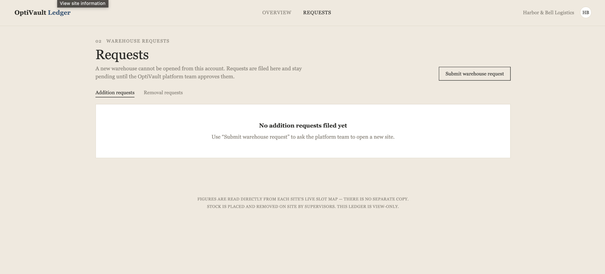

### 27.4 Platform Admin Flow

**Platform Admin → Warehouse Requests / Companies / All Sites**

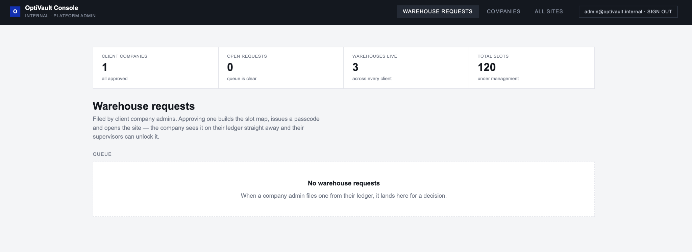

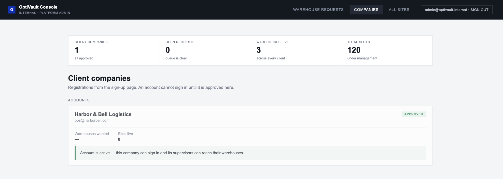

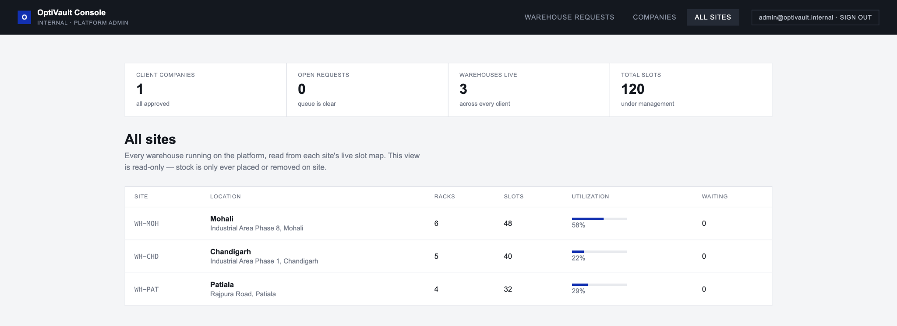

---

## 28. Git Workflow

```bash
git pull origin main
git add .
git commit -m "feat: implement authentication and company registration"
git push origin main
```

| Prefix | Purpose |
|---|---|
| `feat:` | New feature |
| `fix:` | Bug fix |
| `style:` | CSS / UI changes |
| `refactor:` | Code restructuring |
| `docs:` | Documentation |
| `chore:` | Maintenance |

---

## 29. Key JavaScript Concepts Demonstrated

```text
Variables & Constants → Objects & Arrays → Functions → DOM Selection
→ Event Listeners → Form Validation → Conditional Statements
→ Array Methods (map / filter / reduce / forEach / find)
→ LocalStorage → JSON.parse / JSON.stringify → URLSearchParams
→ Timers (setTimeout) → requestAnimationFrame → performance.now()
→ storage event (cross-tab sync) → DOM Manipulation
→ Session Management → Role-Based Navigation
→ First-fit-decreasing allocation algorithm
```

---

## 30. Project Scope

```text
USER ONBOARDING + AUTHENTICATION + ROLE IDENTIFICATION + SESSION CREATION
        +
SLOT ALLOCATION + PACKING OPTIMIZATION + LIVE OPTIMIZER FLAGS
        +
COMPANY-WIDE OVERSIGHT (READ-ONLY LEDGER)
        +
PLATFORM-LEVEL APPROVAL WORKFLOW (COMPANIES + WAREHOUSES)
```

---

> **OptiVault — Warehouse Slot Allocation & Packing Optimization System**
>
> *A frontend simulation of a multi-tenant warehouse platform: authentication, live slot allocation, company oversight, and platform administration — built entirely on HTML, CSS, Vanilla JavaScript, and LocalStorage.*